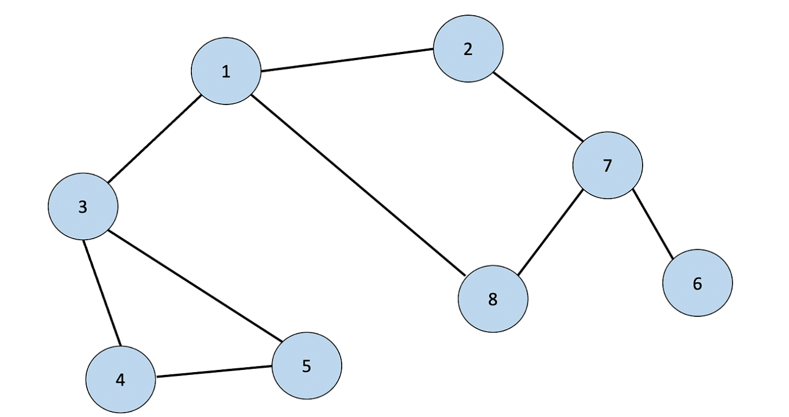

# BFS

### BFS 정의

Breadth First Search알고리즘은 너비우선탐색이라는 의미를 가진다.
쉽게 말해 가까운 노드부터 탐색하는 알고리즘이다.

dfs 구현에서는 선입선출 방식인 큐 자료구조를 이용하는것이 정석.

### BFS 작동 원리

1. 탐색 시작 노드를 큐에 삽입하고 방문처리를 한다.
2. 큐에서 노드를 꺼내 해당 노드의 인접 노드중에서 방문하지 않은 노드를 모두 큐에 삽입하고 방문처리를 한다.
3. 2번의 과정을 더 이상 수행할 수 없을 때까지 반복한다.

### 자세한 동작 예시



1. 1번을 큐에 삽입하고 방문 처리를 한다.
2. 1을 꺼내고 방문하지 않은 인접노드인 2,3,8을 큐에 넣는다. 모두 방문 처리한다다
3. 2를 꺼내고 방문하지 않은 인접노드인 7을 큐에 넣는다, 7을 방문처리한다다
4. 3을 꺼내고 방문하지 않은 인접노드인 4,5를 넣는다, 4,5를 방문 처리한다.
5. 8을 꺼내고 방문하지 않은 인접노드가 없으므로 무시한다.
6. 7을 꺼내고 방문하지 않은 6을 넣는다. 6을 방문처리 한다.
7. 큐에 있는 노드 중에서 방문하지 않은 인접노드가 없다. 모든 노드를 차례대로 꺼낸다.(4,5,6)

### 시간 복잡도

o(N) 소요

일반적인 경우는 실세 수행시간은 dfs보다 좋은 편이다.

### bfs python code

```python
from collections import deque

def bfs(graph, start, visited):
	queue = deque([start])
	visited[start]=True
	while queue:
		v=queue.popleft()
		print(v,end=" ")
		for i in graph[v]:
			if not visited[i]:
				queue.append(i)
				visited[i]=True


graph = [
	[],#0, 노드는 1부터 시작하기 때문에 0번 인덱스틑 공백으로 생성
 	[2,3,8],#1번 노드에 인접한 노드
	[1,7],#2
	[1,4,5],#3
	[3,5],#4
	[3,4],#5
	[7],#6
	[2,6,8],#7
	[1,7]#8
]

visited = [False]*9
bfs(graph,1,visited)

```
