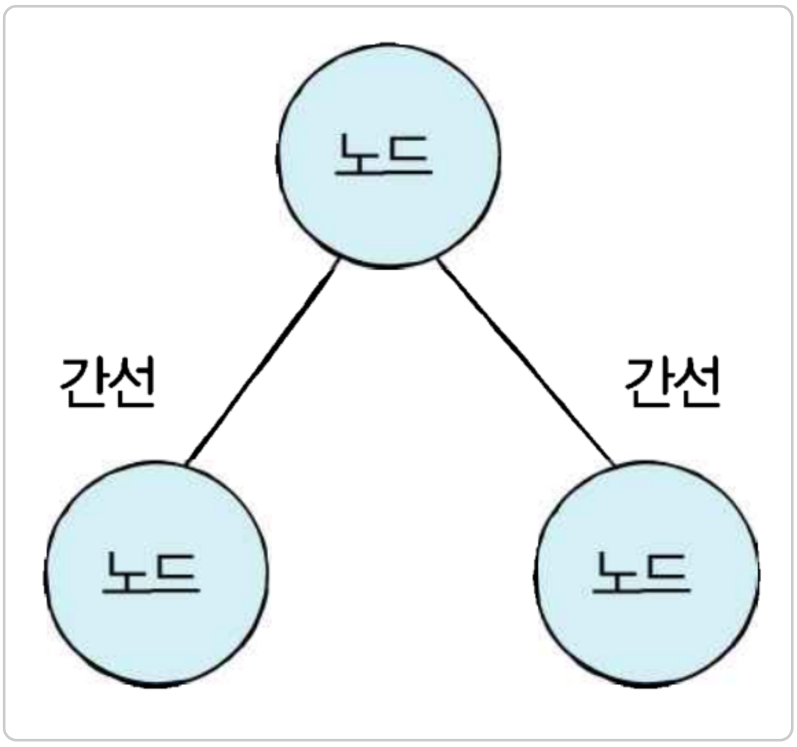
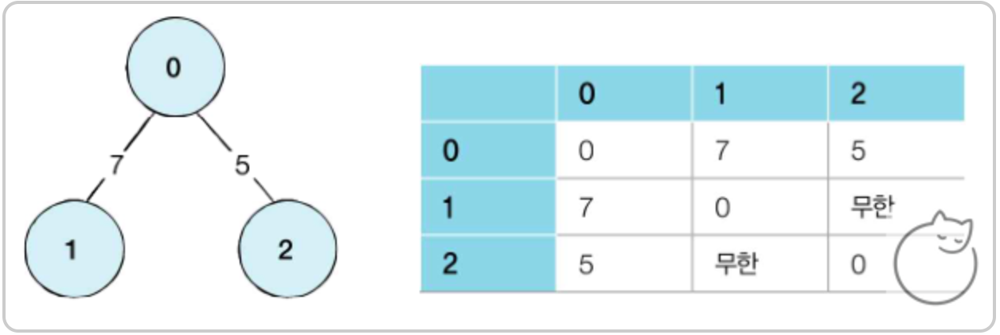
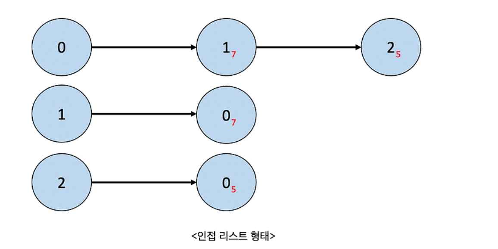
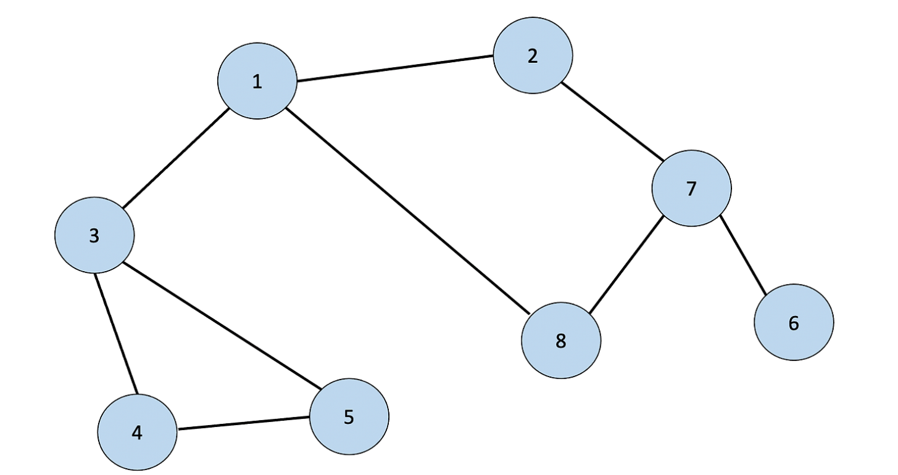

# DFS (Depth First Search)

### 정의

dfs는 깊이 우선 탐색으로 그래프에서 가장 깊은 부분을 우선적으로 탐색하는 알고리즘이다.

### 그래프

노드와 간선으로 표현, 노드를 정점이라고도 말한다.

노드 = 도시, 간선 = 도로 라고 생각하면 된다.


### 그래프를 표현하는 방식

- 인접행렬: 2차원 배열로 그래프의 연결관계를 표현하는 방식
- 인접리스트: 리스트로 그래프의 연결 관계를 표현하는 방식

### 인접행렬 방식

2차원 배열에 각 노드가 연결된 형태를 기록하는 방식

연결이 되어있지 않은 노드끼리는 무한의 비용이라고 작성한다.


```python
INF=99999999
graph = [
	#0인 노드에 연결된 연결관계 (0은 자기자신)
	[0,7,5],
	[7,0,INF],
	[5,INF,0]
]
```

### 인접리스트 방식

모든 노드에 연결된 노드에 대한 정보를 차례대로 연결하여 저장한다.


인접리스트는 연결리스트라는 자료구조 사용
파이썬은 기본자료형인 리스트 자료형에서 append()와 메소드를 제공하므로 리스트를 통해 구현한다.

```python
graph = [[]for _ in range(3)]

graph[0].append((1,7)) #노드, 간선(거리)
graph[0].append((2,5))

graph[1].append((0,7))
graph[2].append((0,5))
print(graph)
```

### 인접행렬과 인접리스트의 차이

- 메모리 측면

  인접행렬은 모든 관계를 저장하므로 노드의 개수가 많을 수록 메모리가 불필요하게 낭비된다.

  인접리스트는 연결된 정보만을 저장하기 때문에 메모리 측면에서는 효율적이다.

- 속도

  인접 리스트 방식은 인접 행렬 방식에 비해 특저안 두 노드가 연결되어 있는지에 대한 정보를 얻는 속도가 느리다

  (연결된 데이터를 하나씩 확인해야하기 때문)

따라서 특정한 노드와 모든 인접 노드를 순회하는 경우는 인접리스트 방식이 인접행렬 방식에 비해 메모리 공간의 낭비가 적다.

# DFS 동작 원리

특정한 경로를 탐색하다가 특정한 상황에서 최대한 깊숙이 들어가서 노드를 방문한후, 다시 돌아가 다른 경로를 탐색하는 알고리즘이다.

### 스택 자료구조를 이용하여 구체적인 동작 과정

1. 탐색 시작 노드를 스택에 삽입하고, 방문처리를 한다.
2. 스택의 최상단 노드에 방문하지 않은 인접 노드가 있으면 그 인접노드를 스택에 넣고 방문처리를 한다.
   방문하지 않은 인접노드가 없다면 최상단 노드에서 꺼낸다.

3. 2번의 과정을 더 이상 수행할 수 없을때 까지 반복한다.

---

### 자세한 동작 원리



1. 시작노드인 1을 스택에 삽입하고 방문처리
2. 스택의 최상단 노드인 1의 인접노드 중 방문하지 않은 2,3,8 중에서 가장 작은 2를 스택에 넣고 방문처리 한다.
3. 최상단 노드 2에서 인접하고 방문하지 않은 7을 방문처리하고 스택에 넣는다.
4. 7의 인접한 노드중 6을 방문처리하고 스택에 넣는다.
5. 6의 인접한 노드 중에서 방문하지 않는 노드가 없기 때문에 스택 최상단에서 노드 6을 없앤다. (7이 최상단)
6. 7의 인접한 노드 중 방문하지 않은 8을 방문처리 후 스택에 넣는다.
7. 8은 인접한 노드 중 방문하지 않은 노드가 없음으로 8을 스택에서 꺼낸다.
8. 최상단 7은 인접한 노드중 방문하지 않은 노드가 없기 때문에 스택에서 꺼낸다.
9. 2역시 스택에서 꺼낸다
10. 1에서 인접한 노드 중 방문하지 않은 노드인 3을 스택에 넣는다.
11. 3의 인접노드중 방문하지 않고 가장 작은 노드인 4를 넣는다.
12. 4에서 방문하지 않고 인접한 노드 5를 넣는다
13. 5에서 인접하고 방문하지 않은 노드가 없음으로 5를 최상단 스택에서 뺀다.
14. 4역시 뺀다.
15. 3역시 뺀다.
16. 1역시 뺸다.
17. 탐색 종료

결과적으로 노드의 탐색 순서 = 스택에 들어간 순서는 다음과 같다.

> 1 -> 2 -> 7 -> 6 -> 8 -> 3 -> 4 -> 5

### dfs pyhon code

```python
def dfs(graph,v,visited):
    visited[v]=True
    print(v,end=" ")

    for i in graph[v]:
        if not visited[i]:
            dfs(graph,i,visited)
graph = [
	[],#0, 노드는 1부터 시작하기 때문에 0번 인덱스틑 공백으로 생성
 	[2,3,8],#1번 노드에 인접한 노드
	[1,7],#2
	[1,4,5],#3
	[3,5],#4
	[3,4],#5
	[7],#6
	[2,6,8],#7
	[1,7]#8
]

visited = [False]*9 #각 노드가 방문된 정보를 리스트 자료형으로 표현

dfs(graph,1,visited)
```

### 시간 복잡도

o(N) 소요
