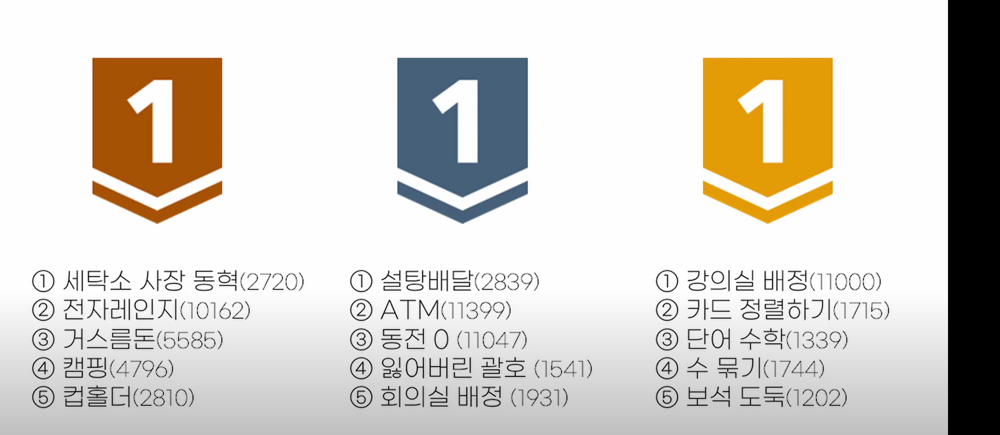

# 그리디

> 그리디 = 탐욕 알고리즘으로
> 매 순간 현재 기준으로 최선의 답을 선택하는 기법이다.

### 장점

dp보다 빠르게 최적의 해를 구해 근사치를 구할 수 있다.

### 조건

- 1. 탐욕적 선택 특성
     지금 선택이 다음 선택에 영향을 주지 않을때 사용한다.
- 2. 최적 부분 구조
     전체 문제의 최적해는 부분 문제의 최적해로 이루어질 때

### 전략

정렬을 잘 하여, 매 선택에서 최적의 해를 선택할 수 있도록 세팅한다.

