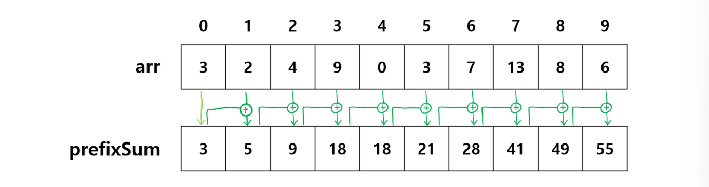
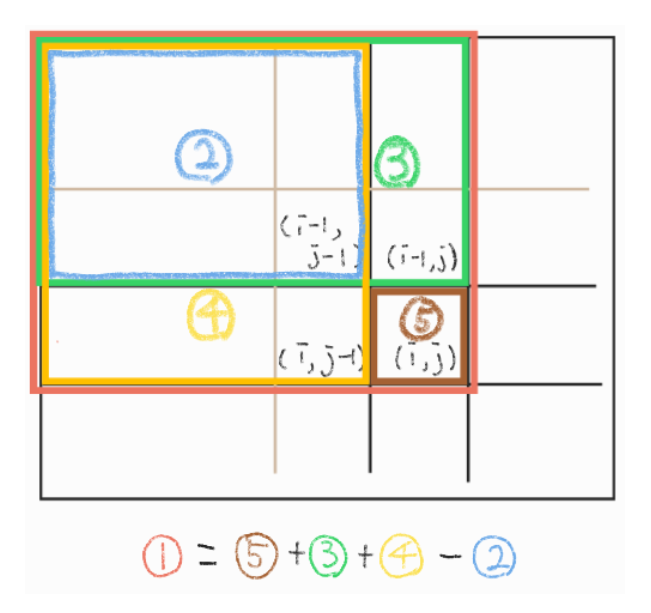
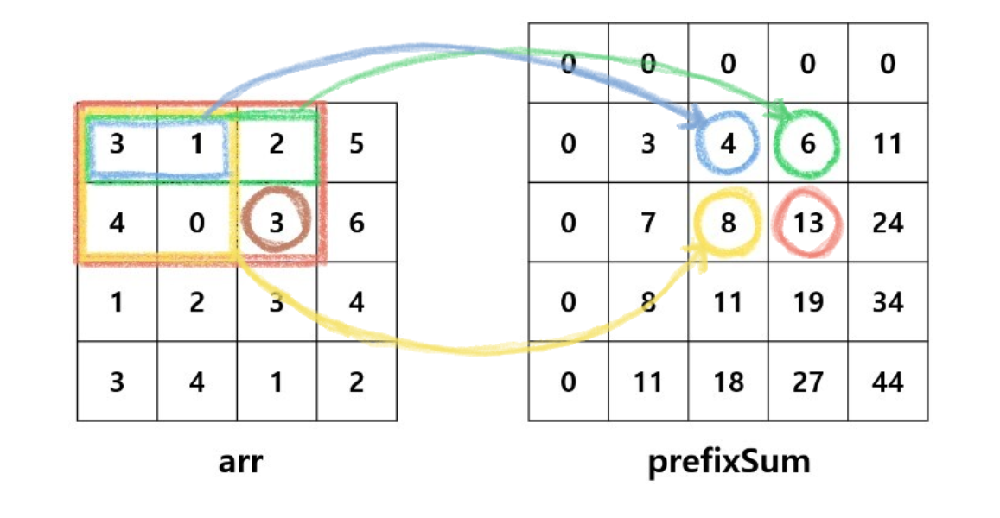

# 누적합

누적합이란 배열의 일부 구간에 대한 합을 빠르게 구할 수 있는 알고리즘이다.

배열의 값들이 변하지 않는다면 누적된 합 또한 변동이 없다는 점을 적용한다.

미리 구해둔 누적합을 통해 배열 중 특정 구간의 부분합을 쉽게 구할 수 있다.

값을 미리 저장해 두는 점에서 DP와 유사하다.

### 누적합의 조건

배열의 값들이 변하지 않는다.

### 1차원 누적합 알고리즘



그림과 같이 앞에서부터 차례대로 누적된 합계를 prefixSum 리스트에 저장한다.

첫번째 값은 arr값과 prefixSum값이 동일하다.

현재 위치의 arr 값에 prefixSum 배열에 저장된 직전 위치 까지의 합을 더하여 현재 위치의 누적합을 구해 prefixSum에 입력한다.

> 점화식 -> prefixSum[i]=arr[i]+prefixSum[i-1]

- 1차원 누적합 코드

```python

def prefix_sum(n):
    prefixSum=[0]*n
    prefixSum[0]=arr[0]
    for i in range(1,n):
        prefixSum[i]=prefixSum[i-1]+arr[i]
    return prefixSum

n=int(input())
arr=list(map(int,input().split()))
prefixSum=prefix_sum(n)
print(prefixSum)
```

### 2차원 누적합 알고리즘



2차원 배열에서 1번 빨간색 영역인 (i,j)까지의 누적합은 3번 초록색 영역과

4번 노란색 구역의 합에서 겹치는 부위인 2번 파란색 구역을 제외하고 새롭게 (i,j)에 해당하는 5번 갈색 구역의 값을 더하여 구한다.

점화식을 원활히 계산하기 위해 prefixSUm에 행과 열을 하나씩 추가하여 빈칸, 0으로 채우는 방법을 사용한다.

> 때 arr보다 prefixSum의 인덱스가 1씩 큰것을 주의해야한다.

prefixSum[i][j]=prefixSum[i-1][j] + prefixSum[i][j-1] - prefixSum[i-1][j-1]+arr[i-1][j-1]



예를 들어 위와 같은 배열 arr이 주어졌을 때, 빨간색 구역의 누적합은

1. arr 초록색 구역의 누적합, 즉 prefixSum에서 초록색 동그라미 표시된 6을 더하고
2. arr의 노란색 구역의 누적합, prefixSum에서의 노란색 동그라미로 표시된 8을 더하고
3. arr의 파란색 구역의 누적합, prefixSum에서의 판색 동그라미로 표시된 4를 빼고
4. 마지막으로 arr의 갈색 동그라미로 표시된 3을 더해줌으로써 구할 수 있다.

따라서 빨간색 구역의 누적합은 6+8-4+3=13이 되어 prefixSum에 저장한다.

- 파이썬 코드

```python
#시간복잡도 o(n**2)의 코드

def prefix_sum(n,m):
    prefixSum=[[0]*(m+1) for _ in range(n+1)]
    for i in range(1,n+1):
        for j in range(1,m+1):
            prefixSum[i][j]=prefixSum[i-1][j]+prefixSum[i][j-1]-prefixSum[i-1][j-1]+arr[i-1][j-1]
        return prefixSum

n,m=map(int,input().split())
arr=[list(map(int,input().split())) for _ in range(n)]
prefixSum=prefix_sum(n,m)
print(prefixSum)

#(i,j)에서 (x,y)까지의 부분합을 구하는 , o(1)의 코드
i,j,x,y=map(int,input().split())
partSum=prefixSum[x][y]-prefixSum[i-1][y]-prefixSum[x][j-1]+prefixSum[i-1][j-1]
print(partSum)

```
